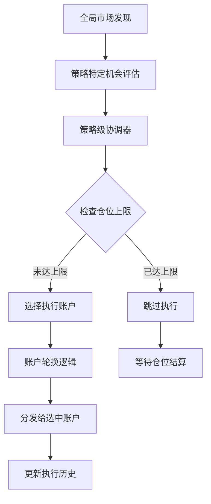

# 策略级协调机制

## 概述

策略级协调机制是一个新的架构组件，用于管理策略级的仓位数量上限和多账户轮换机制。这个功能特别适用于需要精确控制策略执行频率和账户使用公平性的场景。

## 核心功能

### 1. 策略级仓位上限控制

- **功能描述**: 控制整个策略在所有账户中同时可以执行的最大仓位数量
- **应用场景**: 限制高风险策略的总体暴露，确保资金安全
- **配置参数**: `maxConcurrentPositions`

### 2. 多账户轮换机制

- **功能描述**: 在多个账户启用同一策略时，按照"最久未执行账户优先"的原则进行轮换
- **应用场景**: 确保多个账户公平地获得交易机会，避免某些账户被忽略
- **轮换规则**: 
  - 优先选择最久未执行的账户
  - 如果多个账户都没有执行过，随机选择一个
  - 自动跟踪每个账户的最后执行时间

## 架构设计

### 组件结构

```
GlobalStrategyCoordinator
├── StrategyLevelCoordinator (新增)
│   ├── 策略级仓位管理
│   ├── 账户执行历史跟踪
│   └── 账户轮换逻辑
├── MarketDiscoveryService
└── StrategyDispatcher
```

### 核心类

#### StrategyLevelCoordinator

负责策略级的协调工作：

- **仓位跟踪**: 跟踪每个策略的活跃仓位数量
- **账户管理**: 管理启用各策略的账户列表
- **轮换逻辑**: 实现最久未执行账户优先的选择算法
- **配置管理**: 管理策略级的配置参数

## 工作流程

### 1. 机会发现和分发流程



### 2. 账户选择算法

```javascript
// 伪代码
function selectAccountForExecution(strategyType) {
    // 1. 获取启用该策略的账户
    const eligibleAccounts = getEligibleAccounts(strategyType);
    
    // 2. 按最后执行时间排序
    eligibleAccounts.sort((a, b) => a.lastExecutionTime - b.lastExecutionTime);
    
    // 3. 处理从未执行的账户
    const neverExecutedAccounts = eligibleAccounts.filter(acc => acc.lastExecutionTime === 0);
    if (neverExecutedAccounts.length > 1) {
        return randomSelect(neverExecutedAccounts);
    }
    
    // 4. 返回最久未执行的账户
    return eligibleAccounts[0];
}
```

## 配置说明

### 环境变量配置

```bash
# 策略级仓位上限 - 核心配置
HOURLY_ARBITRAGE_MAX_CONCURRENT_POSITIONS=1

# 账户级仓位上限 - 单个账户限制
HOURLY_ARBITRAGE_MAX_ACCOUNT_POSITIONS=5
```

### 配置层级

1. **策略级配置**: 控制整个策略的总体行为
2. **账户级配置**: 控制单个账户的行为
3. **全局配置**: 控制系统整体行为

## 使用示例

### 场景1: 限制高风险策略

```javascript
// 配置每小时套利策略最多同时执行1个仓位
const config = {
    maxConcurrentPositions: 1,  // 策略级上限
    arbitrageAmount: 10,
    minPriceThreshold: 0.4,
    maxPriceThreshold: 0.95
};
```

### 场景2: 多账户公平轮换

假设有账户A和账户B同时启用每小时套利策略：

1. **第1次机会**: 账户A和B都没有执行过，随机选择账户A
2. **第2次机会**: 已达仓位上限(1)，跳过执行
3. **第3次机会**: 账户A仓位结算，选择账户B（B最久未执行）
4. **第4次机会**: 已达仓位上限，跳过执行
5. **第5次机会**: 账户B仓位结算，选择账户A（A最久未执行）

## 监控和调试

### 状态报告

系统提供详细的状态报告，包括：

- 策略级仓位使用情况
- 账户执行历史
- 轮换统计信息
- 机会处理统计

### 调试命令

```javascript
// 打印策略级详细报告
system.printStrategyLevelReport();

// 测试账户轮换机制
system.testAccountRotation('HOURLY_ARBITRAGE');

// 获取策略状态
const status = strategyLevelCoordinator.getStrategyStatus('HOURLY_ARBITRAGE');
```

## 最佳实践

### 1. 仓位上限设置

- **保守策略**: 设置较低的仓位上限（1-2个）
- **积极策略**: 可以设置较高的仓位上限（3-5个）
- **考虑因素**: 资金规模、风险承受能力、市场波动性

### 2. 账户配置

- **账户数量**: 建议2-5个账户启用同一策略
- **资金分配**: 确保每个账户有足够的资金执行策略
- **风险分散**: 不同账户可以使用不同的配置参数

### 3. 监控要点

- **仓位利用率**: 监控策略级仓位的使用效率
- **账户公平性**: 确保各账户获得相对公平的执行机会
- **执行成功率**: 监控机会发现到执行的成功率

## 故障排除

### 常见问题

1. **账户轮换不工作**
   - 检查账户是否正确启用策略
   - 验证账户执行器是否正常运行
   - 查看执行历史是否正确更新

2. **仓位上限不生效**
   - 确认配置参数是否正确设置
   - 检查仓位跟踪是否正常工作
   - 验证仓位结算事件是否正确处理

3. **机会分发失败**
   - 检查策略级协调器是否正确初始化
   - 验证账户执行器注册状态
   - 查看错误日志获取详细信息

### 调试步骤

1. **启用详细日志**: 设置 `LOG_LEVEL=debug`
2. **运行测试脚本**: 使用 `tests/test-strategy-level-coordination.js`
3. **查看状态报告**: 定期打印策略级状态报告
4. **监控事件**: 监听策略级协调器的事件

## 扩展性

### 支持新策略

要为新策略添加策略级协调支持：

1. 在配置文件中添加策略级配置
2. 在全局协调器中添加策略特定的机会发现逻辑
3. 确保策略执行器正确发出仓位事件

### 自定义轮换算法

可以扩展账户选择算法：

```javascript
// 自定义选择算法示例
class CustomAccountSelector {
    selectAccount(eligibleAccounts, strategyType) {
        // 实现自定义选择逻辑
        // 例如：基于账户余额、历史表现等
    }
}
```

## 总结

策略级协调机制提供了精确的策略执行控制和公平的多账户轮换，是多账户交易系统的重要组成部分。通过合理配置和监控，可以显著提高系统的稳定性和公平性。